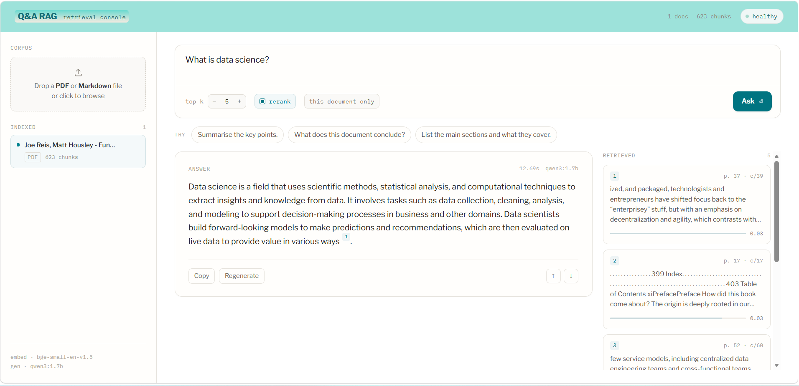
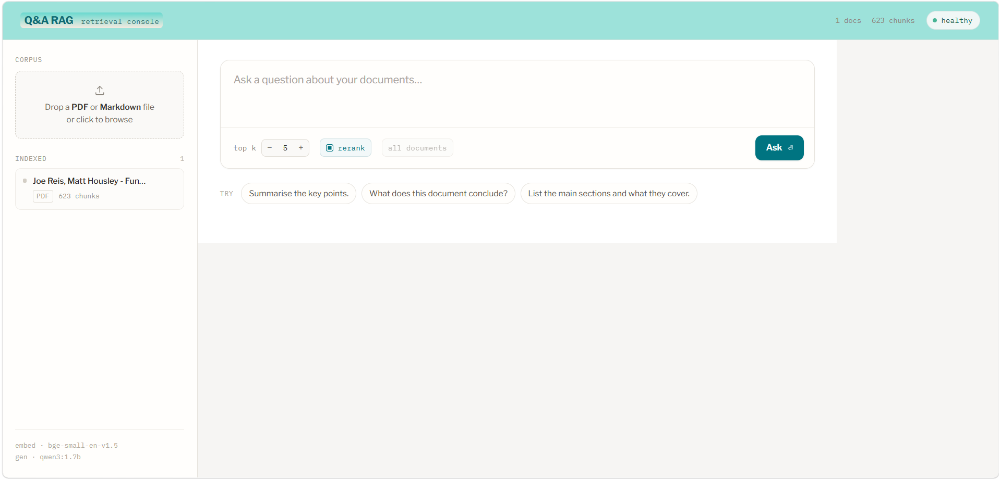
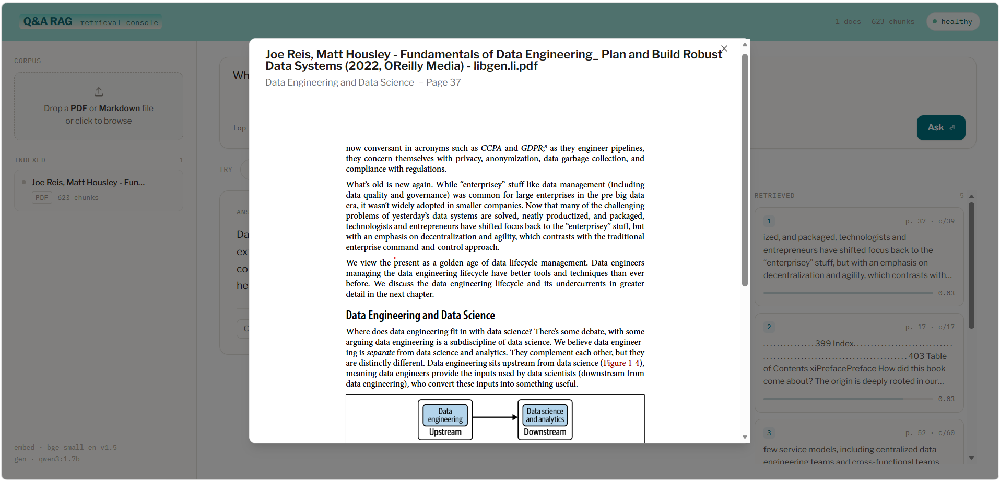

# Q&A RAG

**Local-first question answering over your own PDFs and Markdown, with citations
you can verify.**

Drop in technical documentation, books or research papers, ask questions in plain
language, and get answers grounded in the exact file and page they came from.
Everything runs offline on a laptop: an embedded vector database, a keyword index
and a small local LLM through [Ollama](https://ollama.com). No cloud services and
no API keys.



## What it does

Q&A RAG is a **retrieval-augmented generation (RAG)** system. Instead of asking
an LLM to answer from memory, which is how models make things up, it first
**finds the passages in your documents** that are relevant to the question, then
asks the model to answer **using only those passages** and to cite them.

### 1. Build your corpus



- **Drop a PDF or Markdown file** into the *Corpus* area on the left. The file
  is split into overlapping chunks of about 400 tokens. Each chunk keeps its page
  number and section heading, and is indexed twice: as a vector for meaning-based
  search and in a keyword index for exact-term search.
- The **Indexed** list shows every document and how many chunks it produced. The
  example above is a 400-page book that became 623 chunks.
- The header shows the corpus size and a **health** indicator for the API,
  Ollama and the vector database. The footer names the embedding model
  (`bge-small-en-v1.5`) and the generation model (`qwen3:1.7b`).

### 2. Ask a question

- Type a question, or pick one of the **Try** suggestions, and press **Ask**.
- **top k** sets how many passages are passed to the model (5 by default).
- **rerank** re-scores the candidates with a cross-encoder for better ordering.
  It takes effect when the server runs with `RERANK_ENABLED=true`.
- **this document only / all documents** limits the search to the document
  selected in the left rail, or searches the whole corpus.

### 3. Read the answer and check it

- The **Answer** card shows the model's response with small numbered citation
  markers. It also shows how long the answer took and which model wrote it.
- The **Retrieved** panel on the right lists the passages the answer was built
  from, each with its page (`p. 37`), its chunk number (`c/39`) and a relevance
  score. Hovering a citation marker highlights the passage it points to.
- **Click a citation or a passage** to open the original PDF at the cited page.
  You can check the claim against the source in one click.
- A citation the model invents that doesn't match a passage it was actually
  given is **dropped rather than shown**, so the markers you see always point at
  real text.

### 4. Open the source



Here the question was *"What is data science?"*. Clicking passage 1 (`p. 37`) in
the **Retrieved** panel opens the book at page 37, in the "Data Engineering and
Data Science" section the answer was built from. The viewer shows the document,
the section heading and the page number. You can read the full page around the
passage, not just the extracted snippet, and page through the document from there.

## Features

- **Hybrid retrieval**: dense vectors (Qdrant, embedded) and BM25 keyword search,
  fused with Reciprocal Rank Fusion, with an optional cross-encoder reranker.
- **Citations you can trust**: every answer cites `[filename p.N]`, and each
  citation is checked against the passages the model was shown.
- **Structure-aware ingestion**: PDF and Markdown, with headings, sections and
  page numbers kept end to end, plus a per-document outline.
- **Idempotent**: a document's ID is the SHA-256 of its bytes, so re-ingesting
  the same file is a fast no-op.
- **Swappable components**: embeddings, vector store, keyword index, reranker
  and LLM each sit behind a `Protocol`. Switching one is a config change.
- **Offline evaluation**: recall@k, MRR, keyword overlap and citation checks,
  with no LLM-as-judge.
- **Web UI**: a React workbench that fits on one screen, with a document rail,
  answer view, retrieved-passage panel and a PDF viewer that opens at the cited page.

## How it works

```
 ingest:  PDF / Markdown ─▶ extract + clean ─▶ chunk (token-bounded) ─▶ embed ─┬─▶ Qdrant (dense)
                                                                                └─▶ BM25   (sparse)

 query:   question ─▶ dense + sparse search ─▶ RRF fusion ─▶ (rerank) ─▶ token-budgeted context
                   ─▶ Ollama (qwen3:1.7b) ─▶ answer + verified citations
```

## Tech stack

| Layer | Choice |
|---|---|
| API | Python 3.11, FastAPI, Uvicorn, pydantic-settings |
| PDF extraction | PyMuPDF |
| Dense index | Qdrant (embedded, no server) |
| Sparse index | `rank_bm25` |
| Embeddings | `BAAI/bge-small-en-v1.5` via sentence-transformers (or Ollama `nomic-embed-text`) |
| Generation | Ollama, `qwen3:1.7b` by default |
| Reranker (optional) | `cross-encoder/ms-marco-MiniLM-L-6-v2` |
| Frontend | React 19, Vite, Tailwind v4, TanStack Query, react-pdf |
| Quality | Pytest, Ruff, Mypy (strict on `app/`) |

## Quickstart

**Requirements:** Python 3.11 (pinned for torch / qdrant-client wheels), Node.js 20+
for the UI, and [Ollama](https://ollama.com).

```bash
# 1. Backend
python3.11 -m venv .venv
source .venv/bin/activate            # Windows: .venv\Scripts\activate
pip install -e ".[dev]"
cp .env.example .env                 # every setting, with its default

# 2. Model (never pulled automatically)
ollama pull qwen3:1.7b
python scripts/check_ollama.py       # verifies Ollama is reachable and the model exists

# 3. Ingest some documents and ask a question
python scripts/ingest.py --path path/to/docs/     # a file or a folder (.pdf, .md)
python scripts/query.py "What does the paper say about hybrid retrieval?"

# 4. Run the API
uvicorn app.main:app --reload        # http://localhost:8000  (OpenAPI docs at /docs)
```

**Web UI:**

```bash
cd frontend
npm install
npm run build                        # the API now serves the UI at http://localhost:8000/
# or, for UI development:
npm run dev                          # http://localhost:5173, proxies to the API on :8000
```

> **Performance.** On startup the server loads the embedding model and the LLM in
> the background (about 40 s; turn off with `WARMUP_ON_STARTUP=false`). After
> that, a question takes roughly 10–20 s on a CPU-only laptop, almost all of it
> the LLM writing the answer. `OLLAMA_KEEP_ALIVE=300` keeps the model loaded for
> 5 minutes between questions; set `0` to free the memory after every call.
> The first run also downloads the embedding model once from Hugging Face.
>
> Stop the API before running `ingest.py` or `rebuild_index.py`: embedded Qdrant
> allows only one process at a time.

## API

| Method | Path | Purpose |
|---|---|---|
| `GET` | `/health` | Service and Ollama status |
| `POST` | `/documents` | Upload and ingest a document |
| `GET` | `/documents` | List ingested documents |
| `DELETE` | `/documents/{id}` | Remove a document from both indexes |
| `GET` | `/documents/{id}/file` | Original file (for the viewer) |
| `GET` | `/documents/{id}/outline` | Heading outline |
| `GET` | `/documents/{id}/tables` | Extracted tables (when enabled) |
| `POST` | `/query` | Ask a question, get an answer plus citations |

Full request and response shapes are in [`docs/API.md`](docs/API.md).

## Evaluation

```bash
python scripts/evaluate.py --dataset data/evaluation/eval_dataset.json
```

This writes JSON and Markdown reports with recall@k, MRR, keyword overlap and
citation presence. See [`docs/EVALUATION.md`](docs/EVALUATION.md).

## Development

```bash
pytest -m "not slow and not live_ollama"   # fast loop: no model downloads, no Ollama
pytest                                      # everything
ruff check
mypy app
```

Code rules, conventions and known gotchas are in
[`docs/DEVELOPMENT.md`](docs/DEVELOPMENT.md).

## Documentation

| Doc | What's in it |
|---|---|
| [`docs/WALKTHROUGH.md`](docs/WALKTHROUGH.md) | End-to-end tour of the code and data flow |
| [`docs/ARCHITECTURE.md`](docs/ARCHITECTURE.md) | Layers, protocols, design decisions |
| [`docs/INGESTION.md`](docs/INGESTION.md) | Loading, cleaning, chunking |
| [`docs/OLLAMA.md`](docs/OLLAMA.md) | Model choices and low-memory settings |
| [`docs/EVALUATION.md`](docs/EVALUATION.md) | Dataset format and metrics |
| [`docs/TROUBLESHOOTING.md`](docs/TROUBLESHOOTING.md) | Common errors and fixes |
| [`docs/DEVELOPMENT.md`](docs/DEVELOPMENT.md) | Commands, code rules, roadmap |

## Roadmap

- **V1 (done):** trustworthy single-document Q&A, outlines, citation spans.
- **V2 (seams in place):** OCR for scanned pages, table extraction, structured
  extraction and cross-document comparison. The endpoints exist behind
  `*_ENABLED` flags and currently use no-op providers.
- **V3 (design):** entity and relationship graph, multi-hop retrieval.

## License

[MIT](LICENSE) © 2026 Viktor Shishkoski
