# Q&A RAG — Architecture Report

**Scope:** the entire repository at `C:\Users\vikto\OneDrive\Desktop\Q&A RAG`.
**Method:** every node and edge below was traced from source (imports, calls,
route registrations, store reads/writes, HTTP calls, config references). Nothing
is inferred unless explicitly marked **UNCERTAIN**.
**Date verified:** 2026-09-10.

> **Note on the reference image:** the request referenced an attached visual
> style reference that was not present in the received message. The diagrams
> follow the *written* style spec instead: white background, beige/cream
> rectangles for services and modules, beige diamonds for orchestration and
> decision nodes, cylinders for stores, rounded rectangles for users / external
> systems / outputs, thin gray connectors with labelled arrowheads, grouped
> into subgraphs. Systems and labels are drawn only from this repository.

## Files in this folder

| File | Level | Contents |
|---|---|---|
| `system-overview.mmd` | 1 | Users → entry points → orchestration → modules → stores/infra → outputs |
| `internal-connections.mmd` | 2 | Package + module graph with import/call/read/write edges |
| `data-flow.mmd` | 3 | Payload transformations along ingest, query, delete, rebuild paths |
| `database-relationships.mmd` | 3 | The three index files + three filesystem trees, joined by `document_id` |
| `feature-diagrams.mmd` | 3 | One subgraph per feature (F1–F9) |
| `architecture-report.md` | — | This document + workflow sequence diagrams |

### Rendering

```
# any Mermaid renderer; e.g.
npx -y @mermaid-js/mermaid-cli -i docs/architecture/system-overview.mmd -o system-overview.svg
```
GitHub renders ```mermaid fenced blocks in this file directly.

### Legend (shared by every diagram)

| Shape | Meaning |
|---|---|
| `["rectangle"]` | service, module, route, function, agent |
| `{"diamond"}` | orchestration, routing, decision, workflow branch |
| `[("cylinder")]` | database, index, cache, persistent store |
| `("rounded")` | user, external system, request/response, output artefact |

| Edge | Meaning |
|---|---|
| `-->` solid gray | control/data flow that always happens |
| `-.->` dashed gray | optional path, first-run-only, or HTTP call across a process boundary |
| `-->\|label\|` | the label names the connection type: `imports`, `calls`, `reads`, `writes`, `embeds`, `returns`, `registers`, `mounts`, `transforms`, `decides` |

Colours: cream `#F5EFE0` (modules), warm beige `#EDE3C8` (decisions), tan
`#E7DEC6` (stores), off-white `#FBF8F1` (I/O and external).

---

## 1. System overview (Level 1)

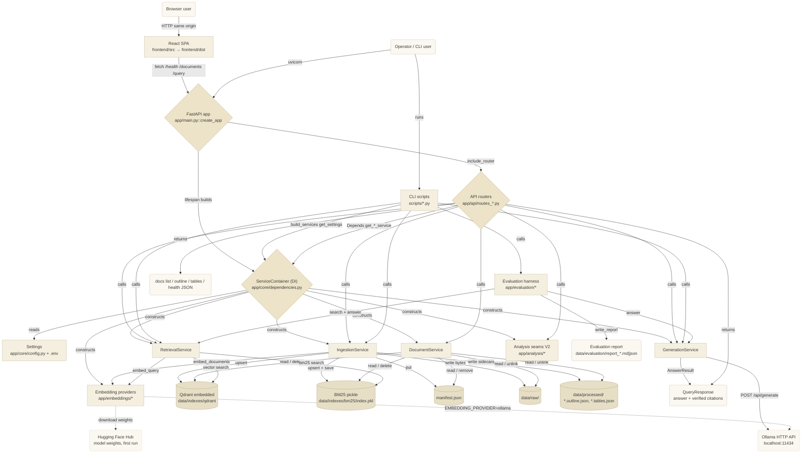

### Node responsibilities (Level 1)

| Node | Responsibility | Path |
|---|---|---|
| Browser user | Uploads documents, asks questions, inspects retrieved chunks and citations | — |
| Operator / CLI user | Runs ingestion, one-shot queries, evaluation, index rebuild, health check | — |
| React SPA | Single-page "retrieval console"; talks to the API over same-origin `fetch` | `frontend/src/**`, built to `frontend/dist/` |
| FastAPI app | Assembles routers, error handler, logging, data dirs; builds the container in `lifespan`; mounts the SPA at `/` | `app/main.py` |
| API routers | Thin HTTP ↔ service translation; one router per concern | `app/api/routes_health.py`, `routes_documents.py`, `routes_query.py`, `routes_analysis.py` |
| ServiceContainer (DI) | The one wiring point: `build_*` factories pick a concrete provider from `Settings`, then compose the four services; FastAPI `get_*` shims read it off `app.state` | `app/core/dependencies.py` |
| Settings | `pydantic-settings` model; reads `.env` + environment | `app/core/config.py` |
| IngestionService | Orchestrates load → clean → chunk → embed → dual-store upsert; idempotent via manifest; writes outline/tables sidecars | `app/ingestion/service.py` |
| DocumentService | List / delete / raw-file / outline / tables reads; `ensure_exists` guard for analysis routes | `app/ingestion/service.py` |
| RetrievalService | Dense + sparse retrieval → Reciprocal Rank Fusion → optional cross-encoder rerank | `app/retrieval/service.py` |
| GenerationService | Token-budgeted context → prompt → LLM call → citation extraction/verification | `app/generation/service.py` |
| Analysis seams (V2) | `OcrEngine`, `TableExtractor`, `StructuredExtractor`, `DocumentComparer` — all NoOp today, flags default `false` | `app/analysis/*.py`, `app/ingestion/ocr.py`, `app/ingestion/tables.py` |
| Embedding providers | `sentence-transformers` (default), Ollama, or deterministic mock | `app/embeddings/*.py` |
| Evaluation harness | Offline retrieval/answer metrics + markdown/JSON report; no LLM judge | `app/evaluation/*.py` |
| Qdrant (embedded) | Dense vector index; local-persistent, single-writer; source of truth for chunks | `data/indexes/qdrant/`, `app/storage/qdrant_store.py` |
| BM25 pickle | Sparse index; a pickled `list[Chunk]`, `BM25Okapi` rebuilt in memory on load | `data/indexes/bm25/index.pkl`, `app/storage/bm25_store.py` |
| manifest.json | `document_id → ManifestEntry`; idempotency ledger | `data/indexes/manifest.json` |
| data/raw | Exact uploaded bytes, named `<document_id><suffix>` | `data/raw/` |
| data/processed | Per-document derived JSON sidecars (`*.outline.json`, `*.tables.json`) | `data/processed/` |
| Ollama | External process for text generation (`/api/generate`) and, optionally, embeddings (`/api/embed`) | `http://localhost:11434` |
| Hugging Face Hub | One-time download of `sentence-transformers` / cross-encoder weights | network, first use only |

---

## 2. Internal architecture (Level 2)

See `internal-connections.mmd` for the full module graph (≈70 nodes). Summary of
each package and its **outgoing** dependencies:

| Package | Purpose | Imports / calls into | Never imports |
|---|---|---|---|
| `app/main.py` | App assembly | `app/api/routes_*`, `app/core/{dependencies,errors,logging}` | — |
| `app/api/` | HTTP routes; request/response DTOs re-exported in `schemas.py` | `app/core/{dependencies,errors}`, `app/models/*`, the four services | business logic (delegates everything) |
| `app/core/` | `config` (Settings), `dependencies` (DI + `ServiceContainer`), `errors`, `logging` | `dependencies` → every provider + service + `config`; imports `fastapi.Depends/Request` | services never import `core.dependencies` |
| `app/models/` | Pydantic domain entities + request/response shapes | `domain` is a leaf; `requests`/`responses` import `domain` | any other `app.*` |
| `app/ingestion/` | Load → clean → chunk → metadata → orchestrate | `service.py` → `loaders`, `cleaning`, `chunking`, `metadata`, `ocr`, `tables`, **`app/analysis/outline`**, `app/embeddings/base`, `app/storage/{vector_store,bm25_store}`, `app/models`, `app/core/errors`; `loaders` → `fitz`; `chunking` → `tiktoken` | FastAPI; `retrieval`; `generation` |
| `app/retrieval/` | Dense + sparse + RRF + rerank | `service` → `dense`, `sparse`, `fusion`, `reranking`, `models`; `dense` → `embeddings/base`, `storage/vector_store`; `sparse` → `storage/bm25_store`; `reranking` → `sentence_transformers` (lazy) | FastAPI; `ingestion`; `generation` |
| `app/generation/` | Context budget → prompt → LLM → citations | `service` → `base`, `context`, `prompts`, `citations`, `models`; **`context` → `app/ingestion/chunking`**; `ollama` → `httpx`, `core/errors` | FastAPI; `retrieval` |
| `app/analysis/` | V2 feature seams operating on an already-ingested doc | `outline` → `models` only; `extraction`/`compare` → `models` only | everything else |
| `app/storage/` | `VectorStore` / `SparseIndex` Protocols + concrete stores | `qdrant_store` → `qdrant_client`, `models`; `bm25_store` → `rank_bm25`, `models` | FastAPI; services |
| `app/embeddings/` | `EmbeddingProvider` Protocol + 3 impls | `sentence_transformers` → `sentence_transformers` (lazy), `core/errors`; `ollama` → `httpx`, `core/errors` | FastAPI; services |
| `app/evaluation/` | Offline benchmark + report | `benchmark` → `dataset`, `metrics`, `retrieval/service`, `generation/service`, `models`; `reporting` → `benchmark` | FastAPI; `ingestion` |
| `scripts/` | Production-wired CLIs | every script → `app/core/{config,dependencies}`; then `build_services(...)` and `container.<service>`; `check_ollama` also imports `app/generation/ollama` directly; `rebuild_index` imports `app/storage/qdrant_store` | — |
| `frontend/src/` | React 19 + Vite + TanStack Query SPA | `api/queries` → `api/client` + `api/types`; `api/client` → `lib/errors`; components → `api/queries`, `lib/citations`, `lib/errors` | — |

The design intent (from `docs/ARCHITECTURE.md` and `docs/DEVELOPMENT.md`) is that
`ingestion`, `retrieval`, and `generation` are **independent** packages that
communicate only through Protocols and the four service classes, so any non-HTTP
caller (`scripts/`, a future UI process) can reuse them. Two edges break that
intent — see [Risks](#7-architectural-risks).

### Frontend module map

| Module | Role | Talks to |
|---|---|---|
| `main.tsx` | React root | `App.tsx` |
| `App.tsx` | `QueryClientProvider` + `Console` layout; holds `selectedId` state | `useDocuments`, `AppShell`, `ChatPanel`, `DocumentList`, `UploadDropzone`, `RailFooter`, `Toaster` |
| `api/client.ts` | The single HTTP module: `apiFetch`, `postForm`, `documentFileUrl`, `fetchText` | `lib/errors.ts` |
| `api/queries.ts` | TanStack Query hooks: `useHealth` (poll 15 s), `useDocuments`, `useUploadDocument`, `useOutline` (lazy), `useDeleteDocument`, `useAskQuestion` | `api/client.ts`, `api/types.ts` |
| `api/types.ts` | Hand-kept mirror of `app/models/**` | — |
| `components/layout/AppShell.tsx` | Shell + `StatusPill` (from `useHealth`) + doc/chunk counters | `useDocuments`, `useHealth` |
| `components/chat/ChatPanel.tsx` | Query state (`topK`, `rerank`, `scopeAll`), staged loading, wires answer + chunks + PDF dialog | `useAskQuestion`, `AnswerView`, `QueryForm`, `RetrievedChunksPanel`, `PdfViewerDialog`, `lib/errors` |
| `components/chat/AnswerView.tsx` | Markdown render; turns `[file p.N]` tags into clickable superscripts; collapses unresolved tags | `lib/citations.ts`, `TimingBadge`, `react-markdown`, `remark-gfm` |
| `components/chat/RetrievedChunksPanel.tsx` | Ranked chunk list; dims chunks not in `context.chunk_ids` | `api/types` |
| `components/documents/DocumentList.tsx` | List, select, delete, expand outline | `useDocuments`, `useDeleteDocument`, `DocumentOutline` |
| `components/documents/DocumentOutline.tsx` | Nested outline, fetched only when expanded | `useOutline` |
| `components/documents/UploadDropzone.tsx` | Drag/drop upload, suffix guard | `useUploadDocument` |
| `components/documents/RailFooter.tsx` | Static provenance line (`bge-small-en-v1.5`, `qwen3:1.7b`) — **hard-coded**, mirrors backend defaults | — |
| `components/pdf/PdfViewerDialog.tsx` | Renders source PDF page (react-pdf) or Markdown for a citation | `client.documentFileUrl`, `client.fetchText`, `ui/dialog`, `ui/button` |

---

## 3. Main data flows

Full detail in `data-flow.mmd`. In prose:

### 3.1 Ingest (write path)
`file_bytes + filename`
→ `load_document` → `list[TextBlock]` (per-page text, every heading, running
section; `clean_text` + `strip_repeated_headers_footers` applied)
→ `document_id = sha256(file_bytes)`; raw bytes written to `data/raw/<id><suffix>`
if absent
→ `build_outline(blocks)` → `list[OutlineNode]` → `data/processed/<id>.outline.json`
(**rewritten every ingest**, so a plain re-upload backfills old docs)
→ `table_extractor.extract(...)` → `[]` (NoOp) → `<id>.tables.json`
→ **decision** `manifest.has(document_id)` → if yes, return `skipped=true` (no
embedding)
→ else `chunk_text` (tiktoken `cl100k_base` sliding window, `CHUNK_SIZE_TOKENS`
/ `CHUNK_OVERLAP_TOKENS` / `CHUNK_MIN_TOKENS`) → `list[ChunkDraft]`
→ `build_chunks` → `list[Chunk]` (`chunk_id = sha256(document_id:index:text)`)
→ `embed_documents` (batched) → vectors
→ `vector_store.upsert(chunks, vectors)` (Qdrant point id `= uuid5(chunk_id)`,
payload `= Chunk` JSON) **and** `sparse_index.upsert(chunks)` + `save()`
→ `manifest.put(ManifestEntry)` → `IngestResponse`.

### 3.2 Query (read path)
`QueryRequest{question, top_k, rerank, filters}`
→ `RetrievalService.search`:
  `DenseRetriever` (`embed_query` → `vector_store.search(candidate_k, DocumentFilter)`)
  and `SparseRetriever` (`bm25_store.search(candidate_k)`) run independently
→ `reciprocal_rank_fusion([dense, sparse], k=RRF_K)` → fused `list[ScoredChunk]`
→ **decision** `request.rerank ?? RERANK_ENABLED` → `CrossEncoderReranker.rerank`
(lazy model load) **or** `fused[:top_k]`
→ `GenerationService.answer`:
  `build_context(chunks, budget)` where
  `budget = (OLLAMA_CONTEXT_LENGTH − OLLAMA_NUM_PREDICT − PROMPT_OVERHEAD_TOKENS)
  × CONTEXT_SAFETY_MARGIN` (floor 100) → `ContextBundle`
  → `build_prompt` + `SYSTEM_PROMPT`
  → `generation_provider.generate` (Ollama `POST /api/generate`, or mock)
  → `extract_citations(text, included_chunks)` — a `[file p.N]` tag survives only
  if it resolves to a chunk that actually reached the model
→ `QueryResponse{answer, citations, retrieved_chunks, context{chunks_used,
chunk_ids, truncated}, model, timing_ms{retrieval_ms, generation_ms}}`.

### 3.3 Delete
`DELETE /documents/{id}` → `DocumentService.delete_document` → guard
`manifest.get(id)` (404 `DocumentNotFoundError` if missing) →
`vector_store.delete_document` + `sparse_index.delete_document` + `save` +
`manifest.remove` + `unlink` raw + `unlink` both sidecars →
`DeleteDocumentResponse{document_id, deleted_chunks}`.

### 3.4 Rebuild BM25
`scripts/rebuild_index.py` → `vector_store.scroll_all()` → `list[Chunk]` →
`sparse_index.rebuild_from(chunks)` + `save()`. Qdrant is never modified; it is
the source of truth from which BM25 is reconstructed after drift.

### 3.5 Evaluate
`scripts/evaluate.py --dataset <json>` → `load_dataset` → `list[EvalCase]` →
`run_benchmark` (per case: `retrieval_service.search` + `generation_service.answer`,
then `recall_at_k` / `mrr` / `lexical_overlap` / `citation_presence`) →
`write_report` → `data/evaluation/report_<timestamp>.{json,md}`.

---

## 4. Database / storage relationships

See `database-relationships.mmd`. There is **no SQL database, no ORM, no Redis**.
Persistence is three index artefacts plus three filesystem trees, all joined by
`document_id = sha256(file_bytes)`:

| Store | Path | Shape | Written by | Read by |
|---|---|---|---|---|
| Qdrant collection `documents` | `data/indexes/qdrant/` | points: `id = uuid5(NAMESPACE, chunk_id)`, `vector` = `float[EMBEDDING_DIM]`, `payload` = full `Chunk` JSON; cosine distance | `IngestionService` (`upsert`), `DocumentService` (`delete_document`) | `DenseRetriever.search`, `rebuild_index` (`scroll_all`), `health` (`count`) |
| BM25 index | `data/indexes/bm25/index.pkl` | pickle of `list[Chunk]`; `BM25Okapi` rebuilt in memory on `load()` | `IngestionService`, `DocumentService`, `rebuild_index` (`rebuild_from`) | `SparseRetriever.search` |
| Manifest | `data/indexes/manifest.json` | `dict[document_id → ManifestEntry{document_id, filename, chunk_count, ingested_at, page_count?}]` | `IngestionService.ingest_document`, `DocumentService.delete_document` | `DocumentService.list_documents` / guards, `rebuild_index` |
| Raw files | `data/raw/<document_id><suffix>` | exact uploaded bytes | `IngestionService` (if absent) | `GET /documents/{id}/file`, `PdfViewerDialog` |
| Outline sidecar | `data/processed/<document_id>.outline.json` | `list[OutlineNode]` nested tree | `IngestionService._write_outline` (**every ingest**) | `DocumentService.outline` → `GET /documents/{id}/outline` |
| Tables sidecar | `data/processed/<document_id>.tables.json` | `list[Table]` (empty with NoOp extractor) | `IngestionService._write_tables` (**every ingest**) | `DocumentService.tables` → `GET /documents/{id}/tables` |
| Evaluation reports | `data/evaluation/report_<ts>.{json,md}` | `BenchmarkReport` | `app/evaluation/reporting.write_report` | humans |

Logical model (`app/models/domain.py`):

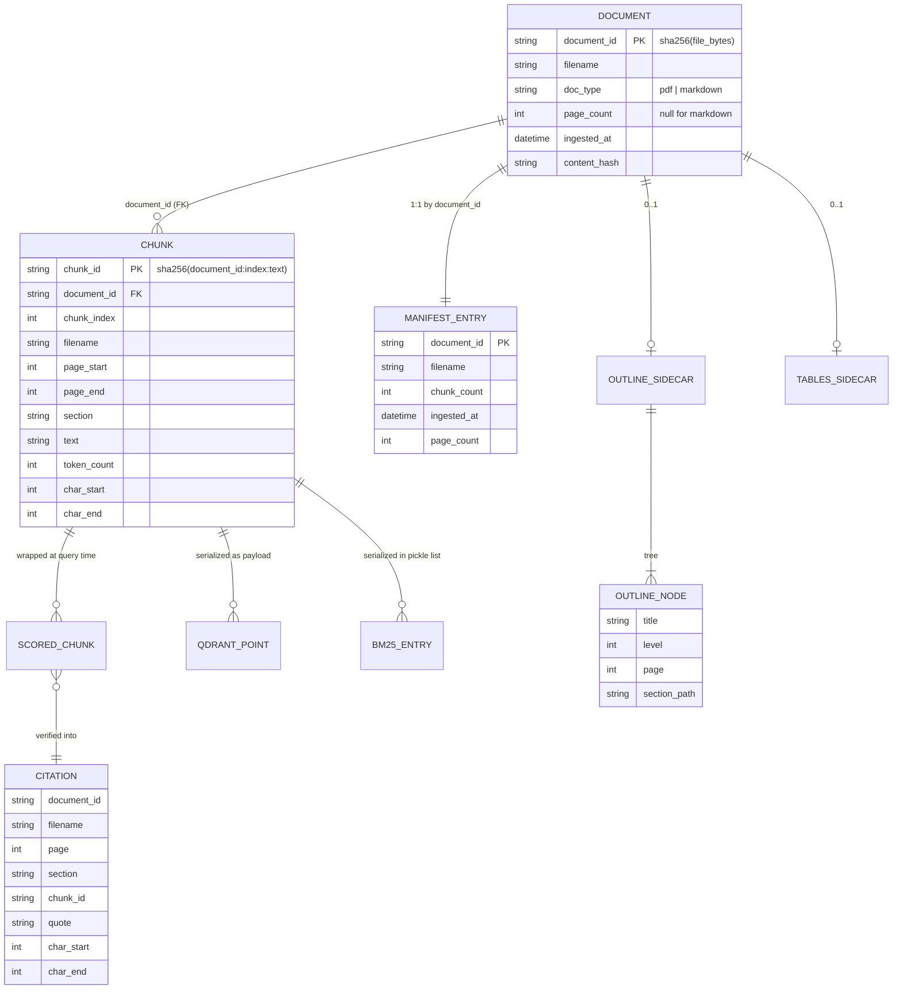

`Citation` is **not persisted** — it is built per query by
`generation/citations.py` from the answer text plus the chunks that reached the
model, then discarded with the response.

---

## 5. Feature diagrams

Each feature also appears as a subgraph in `feature-diagrams.mmd`.

### F1 — Document ingestion (`app/ingestion`)

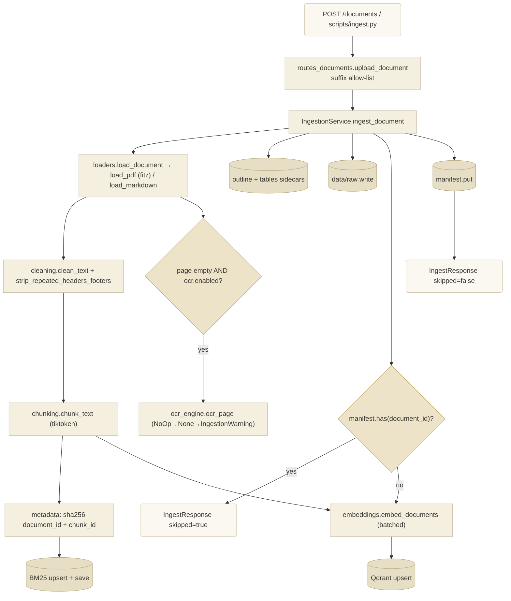

**What it does:** turns a PDF/Markdown upload into embedded, dually-indexed
chunks, idempotently. **Key connections:** `service.py` *imports*
`loaders/chunking/metadata/ocr/tables` and `analysis.outline`; *calls*
`embedding_provider.embed_documents`, `vector_store.upsert`,
`sparse_index.upsert/save`, `manifest.put`; *writes* `data/raw` and two
`data/processed` sidecars on **every** attempt (so re-upload backfills derived
data without re-embedding). **Files:** `app/ingestion/service.py:117`
(`ingest_document`), `:179` (`_write_outline`), `:187` (`_write_tables`);
`app/ingestion/loaders.py:20`; `app/ingestion/chunking.py:43`;
`app/ingestion/metadata.py:12`. **Tests:** `tests/integration/test_ingestion_service.py`,
`tests/integration/test_loaders.py` (incl. a fake OCR engine),
`tests/unit/test_chunking.py`, `test_cleaning.py`, `test_outline.py`.

### F2 — Hybrid retrieval (`app/retrieval`)

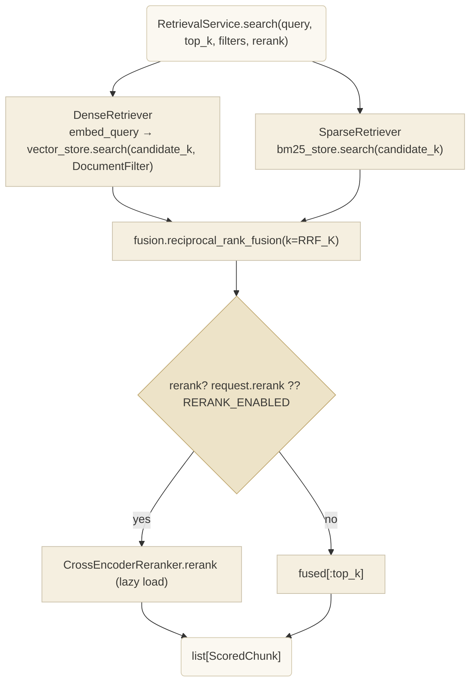

**What it does:** independent dense + sparse recall, merged by RRF (score
`Σ 1/(k+rank)`), optional cross-encoder rerank. **Key connections:** `service.py`
*imports* `dense`, `sparse`, `fusion`, `reranking`; `dense` *calls*
`embedding_provider.embed_query` and `vector_store.search`; `sparse` *calls*
`bm25_store.search`; `DocumentFilter.document_ids` becomes a Qdrant `should`
filter. **Files:** `app/retrieval/service.py:28`, `app/retrieval/dense.py:13`,
`app/retrieval/sparse.py:11`, `app/retrieval/fusion.py:16`,
`app/retrieval/reranking.py:38`, `app/storage/qdrant_store.py:56`.
**Tests:** `tests/integration/test_retrieval_service.py`, `test_vector_store.py`,
`tests/unit/test_fusion.py`, `test_reranking.py`, `test_bm25_store.py`.

### F3 — Grounded generation + citation verification (`app/generation`)

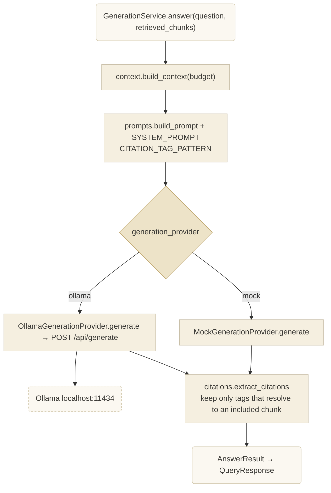

**What it does:** greedily fills a token budget with ranked chunks, prompts the
LLM to cite with `[filename p.N]` tags, then drops any tag that doesn't match a
chunk actually sent. **Key connections:** `service.py` *imports* `base`,
`context`, `prompts`, `citations`; `context.py` *imports*
`app/ingestion/chunking` (token helpers — a layer bypass, see Risks);
`citations.py` and `mock.py` *import* `prompts.CITATION_TAG_PATTERN` (single
source of truth, mirrored by hand in `frontend/src/lib/citations.ts`);
`ollama.py` *calls* `httpx` → `/api/generate` and `/api/tags`. **Files:**
`app/generation/service.py:38`, `context.py:23`, `prompts.py:22`,
`citations.py:19`, `ollama.py:64`. **Tests:** `tests/unit/test_context.py`,
`test_citations.py`, `test_generation_service.py`, `test_generation_mock.py`;
`tests/integration/test_ollama_live.py` (`live_ollama`).

### F4 — Document management

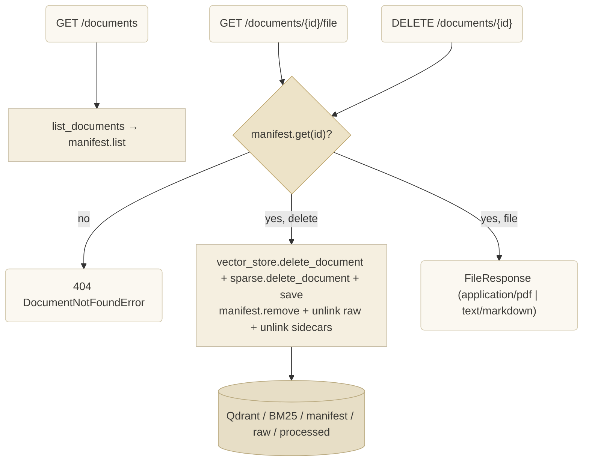

**What it does:** list, delete (cascade across all five stores), and serve the
raw source file. **Files:** `app/api/routes_documents.py:40/59/67`,
`app/ingestion/service.py:216–268`. **Tests:**
`tests/integration/test_api_documents.py`.

### F5 — Outline extraction (`app/analysis/outline.py`)

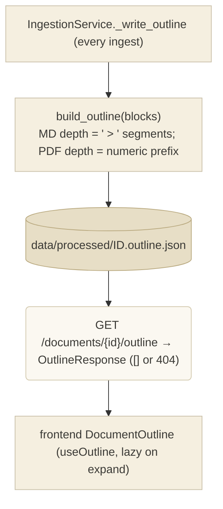

**What it does:** pure function over the loader's heading blocks → nested
`OutlineNode` tree, persisted as a sidecar and re-derived on every ingest so old
documents backfill on a plain re-upload. **Files:** `app/analysis/outline.py:33`,
`app/ingestion/service.py:179`, `app/api/routes_documents.py:75`,
`frontend/src/components/documents/DocumentOutline.tsx`. **Tests:**
`tests/unit/test_outline.py`, `tests/integration/test_api_documents.py`.

### F6 — V2 analysis seams (all NoOp)

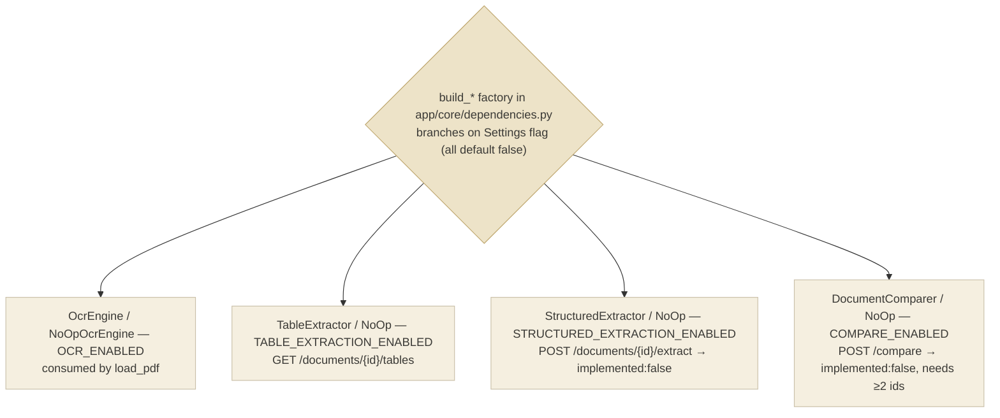

**What it does:** every V2 capability is a Protocol + `NoOp*` default + `build_*`
factory + `ServiceContainer` field + `Settings` flag. With all flags `false` the
app is byte-for-byte V1; the two analysis endpoints are live and return a
well-formed `implemented: false` payload. **Files:** `app/ingestion/ocr.py`,
`app/ingestion/tables.py`, `app/analysis/extraction.py`, `app/analysis/compare.py`,
`app/api/routes_analysis.py`, `app/core/dependencies.py:82–103`. **Tests:**
`tests/unit/test_analysis_seams.py`, `tests/integration/test_api_analysis.py`.
**UNCERTAIN / not wired:** the frontend has TypeScript types for
`StructuredExtractionResult` / `DocumentComparison` but **no hook or component
calls `/extract` or `/compare`**, and the Vite dev proxy does not forward
`/compare`.

### F7 — Offline evaluation (`app/evaluation`)

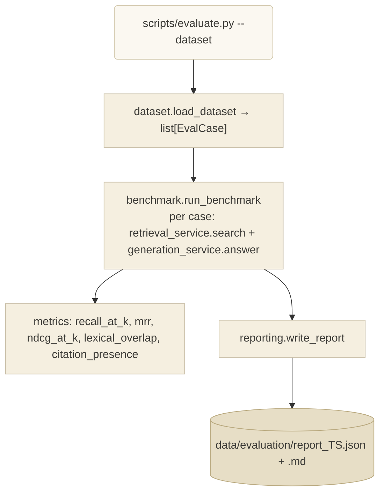

**Files:** `app/evaluation/{dataset,metrics,benchmark,reporting}.py`,
`scripts/evaluate.py`. **Tests:** `tests/unit/test_metrics.py`,
`tests/integration/test_benchmark.py`.

### F8 — Health check

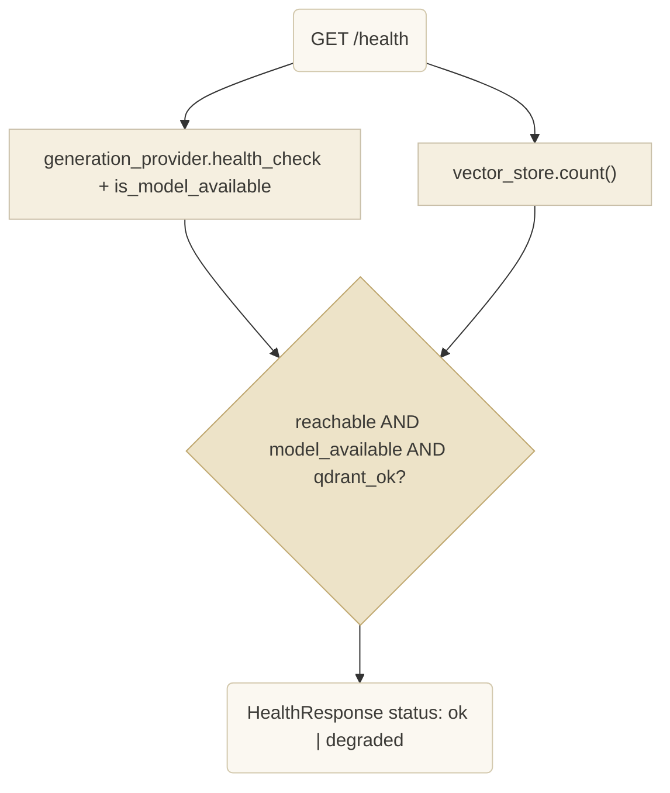

**Note:** `routes_health.py` depends on `get_services` (the whole
`ServiceContainer`) rather than a `get_*_service` shim — the one route that does.
**Files:** `app/api/routes_health.py`. Frontend `useHealth` polls it every 15 s
(`AppShell` `StatusPill`).

### F9 — Frontend retrieval console

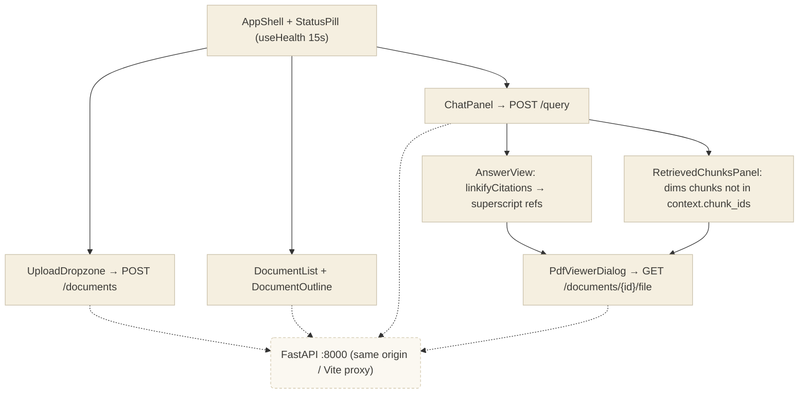

---

## 6. Important workflows (sequence diagrams)

### 6.1 Upload & ingest a document

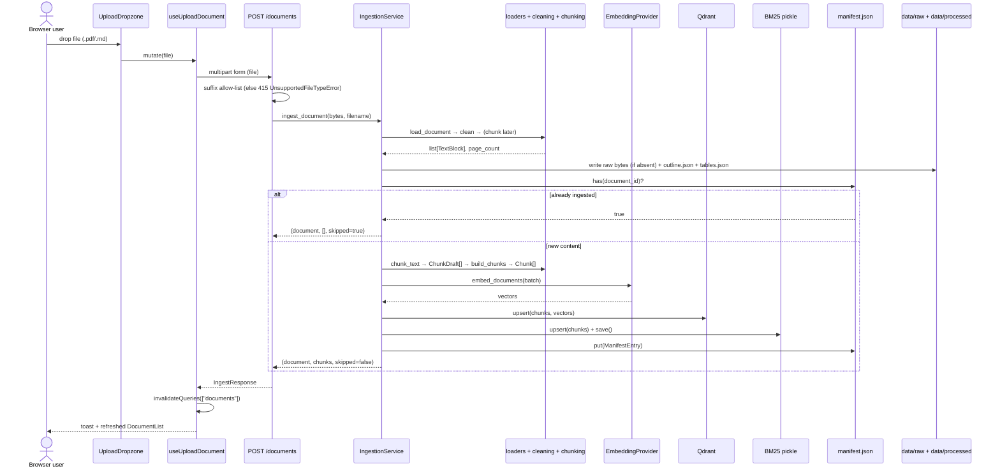

### 6.2 Ask a question

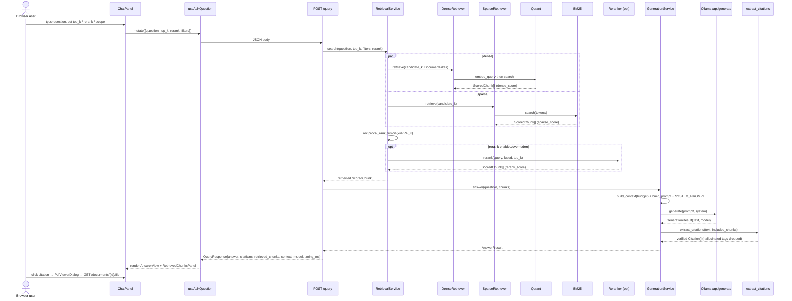

### 6.3 Delete / replace a document

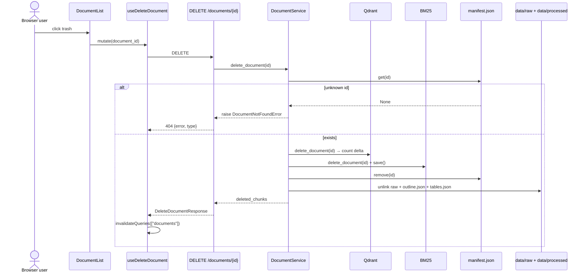

*(To replace a document with edited bytes: its `document_id` changes, so
`DELETE` the old id first — the old version is never auto-removed.)*

---

## 7. Architectural risks

| # | Risk | Evidence | Impact |
|---|---|---|---|
| R1 | **Layer-isolation violation:** `app/generation/context.py:10` imports `app/ingestion/chunking` (`count_tokens`, `decode_tokens`, `encode_tokens`). `docs/DEVELOPMENT.md` / `docs/ARCHITECTURE.md` state `ingestion`, `retrieval`, `generation` "must not import each other." | `grep` confirmed the single edge | `generation` now transitively depends on `tiktoken` and on ingestion's chunking module. Reusing `generation` without `ingestion` is impossible. Fix: move the tiktoken helpers to a shared leaf (e.g. `app/core/tokenization.py`). |
| R2 | **`ingestion` → `analysis` coupling:** `app/ingestion/service.py:14` imports `app/analysis/outline.build_outline`. Intended per the V1 roadmap, but it makes `analysis` a build-time dependency of `ingestion` (the reverse of "analysis operates on an already-ingested document"). | source | Low today (outline is a pure leaf importing only `models`). Watch that `analysis/*` never imports back into `ingestion` or a cycle forms. |
| R3 | **DI layer imports FastAPI:** `app/core/dependencies.py:16` imports `from fastapi import Depends, Request`. Every `scripts/*` imports `dependencies` → pulls FastAPI into pure-CLI processes. | source | Cosmetic coupling; FastAPI is already a hard dep. Could split `ServiceContainer`/`build_*` (framework-free) from the `get_*` shims (FastAPI). |
| R4 | **Dead / drifting module:** `app/api/schemas.py` ("one definition per shape", meant for OpenAPI grouping) is imported by **nothing** (`grep` → none). Routers import `app/models/*` directly. | `grep -rn "api.schemas"` → none | The file can silently fall out of sync with `app/models/*` and no test or route would catch it. Either wire routers to it or delete it. |
| R5 | **Three hand-kept mirrors** of one contract: `app/generation/prompts.py::CITATION_TAG_PATTERN` ↔ `frontend/src/lib/citations.ts`; `app/models/*` ↔ `frontend/src/api/types.ts`; backend model defaults ↔ `frontend/src/components/documents/RailFooter.tsx` (hard-coded `bge-small-en-v1.5` / `qwen3:1.7b`). | file comments say "keep in sync by hand" | Drift risk on every model/shape/config change; no codegen or contract test. |
| R6 | **Single-writer stores, no lock:** embedded Qdrant and the BM25 pickle open the same directories from `uvicorn` **and** from `scripts/ingest.py` / `rebuild_index.py`. `docs/DEVELOPMENT.md` warns "stop the server first." | `docs` + `bm25_store.py` docstring | A second writer raises "Storage folder already accessed" or corrupts the pickle. No programmatic guard. |
| R7 | **BM25 ↔ Qdrant drift:** two independent indexes updated in sequence (`upsert` Qdrant, then `upsert`+`save` BM25). An interrupt between them leaves them inconsistent until `rebuild_index.py` is run manually. | `ingestion/service.py:164–166` | Recoverable but not automatic; no consistency check on startup. |
| R8 | **BM25 memory + O(n) search:** `BM25Store` holds the entire corpus in memory as `list[Chunk]` and `get_scores` scans every chunk per query. | `bm25_store.py:61` | Fine for a local corpus; linear degradation with size. |
| R9 | **No auth / no rate limiting / permissive file intake:** every route is unauthenticated; `POST /documents` reads the whole upload into memory (`await file.read()`) with no size cap. | `routes_documents.py:35`, absence of any auth dependency | Acceptable for a local single-user tool; unsafe if ever exposed. |
| R10 | **`GET /health` swallows all exceptions** from `vector_store.count()` (`except Exception`) and reports `qdrant:false` — a bug in `count()` looks identical to "Qdrant down." | `routes_health.py:24–28` | Masks real errors in monitoring. |
| R11 | **Vite dev proxy incomplete:** proxies `/health`, `/documents`, `/query` only. `/compare` is not forwarded (would 404 in `npm run dev`). Harmless today because nothing calls it. | `frontend/vite.config.ts` | Will bite whoever first wires the compare UI. |
| R12 | **`OLLAMA_NUM_PARALLEL`** is read into `Settings` and `.env.example` but never used (Ollama only honours it as an OS env var before `ollama serve`). | `config.py:15`, `ollama.py` docstring | Config that looks effective but isn't; documented, but a trap. |

## 8. Circular dependencies

**No import cycles were found** among `app/*` modules. The dependency graph is a
DAG rooted at `app/main.py` → `app/api/*` → `app/core/dependencies.py` → the
service/provider modules → `app/models/domain.py` (leaf) and the third-party
libraries.

Points worth noting (not cycles, but bidirectional *concept* coupling):

* `ingestion → analysis` (R2) and `generation → ingestion` (R1) are one-way
  edges that contradict the stated layering; neither target imports back, so no
  cycle exists **yet**.
* `app/models/domain.py::OutlineNode` is a self-referential Pydantic model
  (`children: list[OutlineNode]`) — a recursive *type*, not a module cycle.
* `frontend` has no cycles: `main → App → components → api/queries → api/client →
  lib`.

## 9. External dependencies

| Dependency | Used by | Connection type | Notes |
|---|---|---|---|
| **Ollama** (`localhost:11434`) | `app/generation/ollama.py` (`/api/generate`, `/api/tags`), `app/embeddings/ollama.py` (`/api/embed`, only if `EMBEDDING_PROVIDER=ollama`), `scripts/check_ollama.py` | HTTP via `httpx` | Never auto-pulls models. `OLLAMA_KEEP_ALIVE=0` → model reloaded per call (slow first query). |
| **Hugging Face Hub** | `app/embeddings/sentence_transformers.py`, `app/retrieval/reranking.py::CrossEncoderReranker` | HTTPS download, first use only, cached | Adds `torch` (~0.5–1 GB RSS). Avoided entirely with `EMBEDDING_PROVIDER=ollama` and `RERANK_ENABLED=false`. |
| **PyMuPDF (`fitz`)** | `app/ingestion/loaders.py` | Python import | PDF text + font-size heading heuristic + page rendering for OCR seam. |
| **`tiktoken` (`cl100k_base`)** | `app/ingestion/chunking.py` (→ transitively `app/generation/context.py`) | Python import | Approximate stand-in for qwen3's tokenizer; `CONTEXT_SAFETY_MARGIN` absorbs the mismatch. |
| **`qdrant-client`** | `app/storage/qdrant_store.py` | Python import, embedded mode (`QdrantClient(path=...)`) | No server/Docker. |
| **`rank_bm25` (`BM25Okapi`)** | `app/storage/bm25_store.py` | Python import | |
| **FastAPI + Uvicorn + `python-multipart`** | `app/main.py`, `app/api/*`, `app/core/dependencies.py` | web framework | |
| **Pydantic + `pydantic-settings`** | `app/models/*`, `app/core/config.py`, most modules | data modelling / env config | |
| **React 19, Vite 8, TanStack Query 5** | `frontend/src/*` | SPA runtime / build / server-state | Dev server proxies `/health`, `/documents`, `/query` to `:8000`. |
| **`react-pdf` + `pdfjs-dist`** | `frontend/src/components/pdf/PdfViewerDialog.tsx` | client-side PDF render | Worker loaded from `pdfjs-dist/build/pdf.worker.min.mjs?url`. |
| **`react-markdown` + `remark-gfm`**, **`sonner`**, **`lucide-react`**, **Radix Dialog**, **Tailwind 4** | `frontend/src/components/*` | UI | |
| **`reportlab`** (dev only) | `tests/fixtures/generate_sample_pdf.py` | test fixture generation | |

There is **no Redis, no message queue, no task queue, no cron/scheduler, no
background worker, no external database, no cloud service, no telemetry/logging
service** in the repository. The only periodic behaviour is client-side:
`useHealth` refetches every 15 s and `useOutline` has a 5-minute `staleTime`
(`frontend/src/api/queries.ts`).

## 10. Authentication & authorization

**None.** No login, session, token, API key, CORS config, or per-route guard
exists anywhere in `app/` or `frontend/`. The only access checks are
*existence* guards (`DocumentService._require` → 404) and the upload suffix
allow-list (→ 415). The app is designed as a local, single-user, same-origin
tool (`docs/ARCHITECTURE.md` "UI serving model"). Exposing it to a network would
require adding auth, an upload size limit, and CORS handling.

## 11. Configuration & environment variables

All config flows through `app/core/config.py::Settings` (`pydantic-settings`,
reads `.env` then OS env). `app/core/dependencies.py::get_settings` is
`@lru_cache`. Documented in `.env.example`.

| Group | Vars | Consumed in |
|---|---|---|
| Ollama | `OLLAMA_BASE_URL`, `OLLAMA_GENERATION_MODEL`, `OLLAMA_CONTEXT_LENGTH`, `OLLAMA_NUM_PREDICT`, `OLLAMA_NUM_PARALLEL` *(unused, R12)*, `OLLAMA_KEEP_ALIVE`, `OLLAMA_THINK`, `OLLAMA_TIMEOUT_S` | `build_generation_provider`, `OllamaGenerationProvider`, context budget calc |
| Embeddings | `EMBEDDING_PROVIDER` (`sentence_transformers`\|`ollama`\|`mock`), `EMBEDDING_MODEL`, `EMBEDDING_OLLAMA_MODEL`, `EMBEDDING_DIM`, `EMBEDDING_BATCH_SIZE` | `build_embedding_provider`, `IngestionService` batch loop |
| Storage | `QDRANT_PATH`, `QDRANT_COLLECTION`, `BM25_INDEX_PATH`, `MANIFEST_PATH`, `RAW_STORAGE_PATH`, `PROCESSED_STORAGE_PATH` | `build_vector_store`, `build_sparse_index`, `build_manifest`, both services |
| V2 flags (default `false`) | `OCR_ENABLED`, `TABLE_EXTRACTION_ENABLED`, `STRUCTURED_EXTRACTION_ENABLED`, `COMPARE_ENABLED` | `build_ocr_engine`/`build_table_extractor`/`build_structured_extractor`/`build_document_comparer` — *currently return NoOp regardless of flag; the flag branch is a TODO in each factory* |
| Chunking | `CHUNK_SIZE_TOKENS`, `CHUNK_OVERLAP_TOKENS`, `CHUNK_MIN_TOKENS` | `IngestionService` → `chunk_text` |
| Retrieval | `RETRIEVAL_CANDIDATE_K`, `RRF_K`, `RERANK_ENABLED`, `RERANK_MODEL`, `RERANK_CANDIDATE_POOL` *(defined, not referenced in `app/`)* | `RetrievalService`, `build_reranker` |
| Generation budget | `GENERATION_PROVIDER` (`ollama`\|`mock`), `PROMPT_OVERHEAD_TOKENS`, `CONTEXT_SAFETY_MARGIN` | `ServiceContainer` budget calc, `build_generation_provider` |
| Misc | `LOG_LEVEL` | `configure_logging` |

> **UNCERTAIN:** `RERANK_CANDIDATE_POOL` and `OLLAMA_NUM_PARALLEL` are declared in
> `Settings` / `.env.example` but I found no read of them in `app/`. Likely
> reserved for future tuning.

## 12. Tests → modules exercised

| Test file | Marker | Exercises |
|---|---|---|
| `tests/unit/test_chunking.py` | — | `ingestion/chunking.chunk_text`, `count_tokens` |
| `tests/unit/test_cleaning.py` | — | `ingestion/cleaning` |
| `tests/unit/test_outline.py` | — | `analysis/outline.build_outline`, `flatten_outline` |
| `tests/unit/test_fusion.py` | — | `retrieval/fusion.reciprocal_rank_fusion` |
| `tests/unit/test_reranking.py` | — | `retrieval/reranking.NoOpReranker` |
| `tests/unit/test_bm25_store.py` | — | `storage/bm25_store.BM25Store` |
| `tests/unit/test_context.py` | — | `generation/context.build_context`, `render_chunk` |
| `tests/unit/test_citations.py` | — | `generation/citations.extract_citations` |
| `tests/unit/test_generation_service.py` / `test_generation_mock.py` | — | `generation/service`, `generation/mock` |
| `tests/unit/test_metrics.py` | — | `evaluation/metrics` (incl. `ndcg_at_k`) |
| `tests/unit/test_embeddings_mock.py` | — | `embeddings/mock`, `embeddings/base` Protocol |
| `tests/unit/test_config.py` | — | `core/config.Settings` |
| `tests/unit/test_errors.py` | — | `core/errors` hierarchy + `ERROR_STATUS_MAP` |
| `tests/unit/test_analysis_seams.py` | — | NoOp contracts: `ocr`, `tables`, `analysis/extraction`, `analysis/compare` |
| `tests/integration/test_api_documents.py` | — | `main.create_app` + `routes_documents` (upload, list, delete, outline, provenance) via `build_services` |
| `tests/integration/test_api_query.py` | — | `routes_query` end-to-end incl. `context` provenance contract |
| `tests/integration/test_api_analysis.py` | — | `routes_analysis` (`/extract`, `/compare`) happy path + 404/422 |
| `tests/integration/test_ingestion_service.py` | — | `IngestionService` + `DocumentService` + real `QdrantVectorStore` + `BM25Store` (mock embeddings) |
| `tests/integration/test_retrieval_service.py` | — | `RetrievalService` over real stores, mock embeddings |
| `tests/integration/test_vector_store.py` | — | `QdrantVectorStore` incl. `DocumentFilter` |
| `tests/integration/test_loaders.py` | — | `loaders.load_document/load_pdf/load_markdown` incl. fake OCR engine |
| `tests/integration/test_benchmark.py` | — | full `evaluation` pipeline with mock providers + real stores |
| `tests/integration/test_scripts.py` | — | `scripts/ingest.py`, `query.py`, `evaluate.py` as real subprocesses (mock providers, tmp dirs) |
| `tests/integration/test_embeddings_real.py` | `slow` | `SentenceTransformersEmbeddingProvider` with real weights |
| `tests/integration/test_ollama_live.py` | `live_ollama` | `OllamaGenerationProvider` + `GenerationService` against a running Ollama |

Fast loop: `pytest -m "not slow and not live_ollama"`.

---

## Appendix — connection catalogue (evidence index)

| From | To | Type | Evidence |
|---|---|---|---|
| `app/main.py` | `app/api/routes_*` | route registration | `app/main.py:21-24,48-51` `include_router` |
| `app/main.py` | `frontend/dist` | static mount | `app/main.py:62-64` `StaticFiles(directory="frontend/dist")` |
| `app/main.py` | `core/dependencies.build_services` | call (lifespan) | `app/main.py:35,43` |
| `routes_query` | `RetrievalService`, `GenerationService` | call via `Depends` | `app/api/routes_query.py:18-27` |
| `routes_documents` | `IngestionService`, `DocumentService` | call via `Depends` | `app/api/routes_documents.py:26-90` |
| `routes_analysis` | `DocumentService`, `StructuredExtractor`, `DocumentComparer` | call via `Depends` | `app/api/routes_analysis.py:27-46` |
| `routes_health` | `ServiceContainer` (`get_services`) | call | `app/api/routes_health.py:13-28` |
| `core/dependencies` | all providers + 4 services | construction | `app/core/dependencies.py:47-171` |
| `IngestionService` | `analysis/outline.build_outline` | import + call | `app/ingestion/service.py:14,184` |
| `IngestionService` | `embeddings.embed_documents` | call | `app/ingestion/service.py:162` |
| `IngestionService` | Qdrant / BM25 / manifest / raw / processed | write | `app/ingestion/service.py:135-176` |
| `loaders` | `fitz` (PyMuPDF) | import | `app/ingestion/loaders.py:10` |
| `chunking` | `tiktoken` | import | `app/ingestion/chunking.py:17,21` |
| `generation/context` | `ingestion/chunking` | import **(layer bypass)** | `app/generation/context.py:10` |
| `generation/service` | `context`, `prompts`, `citations`, `base` | import + call | `app/generation/service.py:8-11,38-50` |
| `generation/citations` & `generation/mock` | `prompts.CITATION_TAG_PATTERN` | import | `app/generation/citations.py:13`, `app/generation/mock.py:10` |
| `generation/ollama` | Ollama HTTP | API request (`httpx`) | `app/generation/ollama.py:37,88` |
| `RetrievalService` | `dense`, `sparse`, `fusion`, `reranking` | import + call | `app/retrieval/service.py:1-45` |
| `DenseRetriever` | `embeddings.embed_query`, `vector_store.search` | call | `app/retrieval/dense.py:13-15` |
| `SparseRetriever` | `bm25_store.search` | call | `app/retrieval/sparse.py:11-12` |
| `reranking.CrossEncoderReranker` | `sentence_transformers.CrossEncoder` | lazy import | `app/retrieval/reranking.py:31-35` |
| `QdrantVectorStore` | `qdrant_client` + `data/indexes/qdrant` | import + read/write | `app/storage/qdrant_store.py:9,30` |
| `BM25Store` | `rank_bm25` + `index.pkl` | import + read/write | `app/storage/bm25_store.py:13,77-85` |
| `embeddings/sentence_transformers` | HF weights | lazy download | `app/embeddings/sentence_transformers.py:24-28` |
| `embeddings/ollama` | Ollama `/api/embed` | API request | `app/embeddings/ollama.py:27` |
| `evaluation/benchmark` | `RetrievalService`, `GenerationService` | import + call | `app/evaluation/benchmark.py:6-8,38-40` |
| `evaluation/reporting` | `data/evaluation/` | write | `app/evaluation/reporting.py:9-14` |
| every `scripts/*` | `core/config`, `core/dependencies` | import + `build_services` | `scripts/*.py` headers |
| `scripts/rebuild_index` | `vector_store.scroll_all` → `sparse_index.rebuild_from` | call | `scripts/rebuild_index.py:34-36` |
| `scripts/check_ollama` | `generation/ollama.OllamaGenerationProvider` | import + call | `scripts/check_ollama.py:15,20` |
| `frontend api/queries` | `/health`, `/documents`, `/documents/{id}/outline`, `/query` | HTTP | `frontend/src/api/queries.ts:19,28,38,50,60,72` |
| `frontend api/client` | `/documents/{id}/file` | HTTP | `frontend/src/api/client.ts:44-53` |
| `frontend lib/citations` | `prompts.CITATION_TAG_PATTERN` | hand-mirrored regex | `frontend/src/lib/citations.ts:9` |
| `frontend api/types` | `app/models/**` | hand-mirrored types | `frontend/src/api/types.ts:1-2` |
